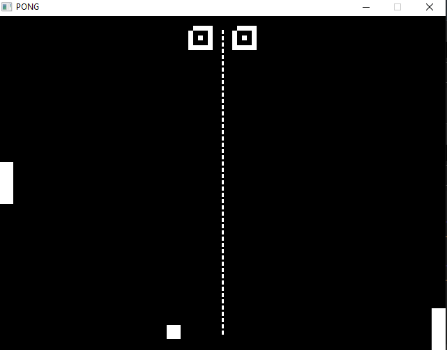

# Pong

pong game made using sdl2 library found on the internet.

## How to run:
after installing sdl2 on your pc run this command in your command prompt:
```bash
mingw32-make.exe
```
and the open the SDLmain.exe file created in the same folder

## How the game looks:
