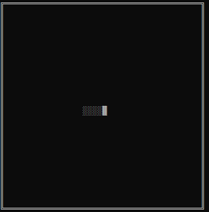

# Snake Game
this is a shitty snake game made on the terminal using the standard C libraries

## How to run it:
using the usual gcc command
```bash
gcc snake.c
```

## How it looks for now:


## TO DO:
- [x] create walls for the game.
- [x] create snake body.
- [ ] create apples.
- [ ] create movements.
- [ ] create game loop.
- [ ] update tail.
- [ ] Game Over.
- [ ] Scores and save Highscore into a file.